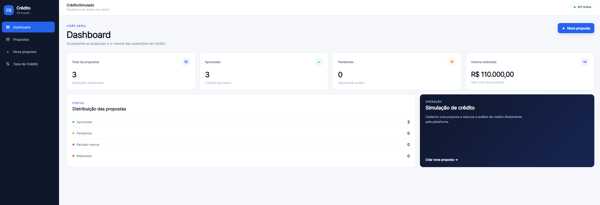
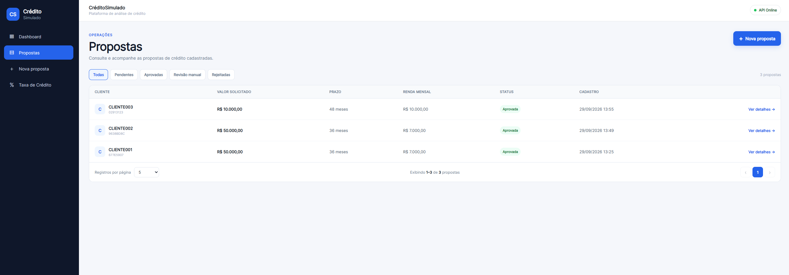
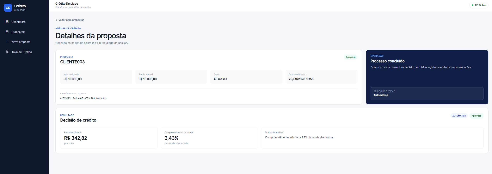
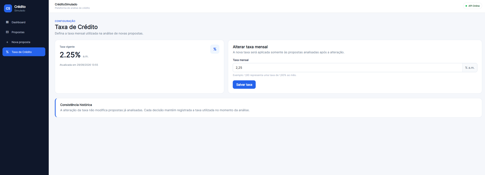

# CréditoSimulado

Aplicação full stack para simulação, análise e gerenciamento de propostas de crédito, desenvolvida com **.NET 10, ASP.NET Core, Angular 20, PostgreSQL e Docker**.

O projeto demonstra na prática organização arquitetural, regras de domínio, APIs REST, persistência relacional, frontend SPA, testes automatizados e integração contínua.

> **Aviso:** este projeto possui finalidade exclusivamente técnica e educacional. Não realiza concessão real de crédito.

---

## Funcionalidades

- Cadastro de propostas de crédito
- Consulta e filtro de propostas
- Análise automática de crédito
- Classificação em aprovação, revisão manual ou rejeição
- Aprovação e rejeição manual
- Dashboard com indicadores
- Taxa de crédito configurável
- Preservação da taxa utilizada em cada análise
- Monitoramento da disponibilidade da API pelo frontend

---

## Tecnologias

### Backend

- C# / .NET 10
- ASP.NET Core
- Minimal APIs
- Npgsql
- OpenAPI / Scalar
- ProblemDetails

### Frontend

- Angular 20
- TypeScript
- Angular Router
- Angular Forms
- HttpClient
- RxJS
- HTML / CSS responsivo

### Dados e infraestrutura

- PostgreSQL 17
- Docker / Docker Compose
- Git
- GitHub Actions

### Arquitetura e práticas

- Clean Architecture
- Domain-Driven Design (DDD)
- CQRS
- Repository Pattern
- Dependency Injection
- SOLID
- Separação de responsabilidades
- Regras de negócio encapsuladas no domínio

### Testes

- xUnit
- Testes unitários
- Testes de integração com PostgreSQL
- **35 testes automatizados**

---

## Arquitetura

```text
Angular 20
    |
    | HTTP / JSON
    v
ASP.NET Core API
    |
    v
Application
Commands / Queries / Handlers
    |
    v
Domain
Entidades / Value Objects / Regras
    |
    v
Infrastructure
Repositories / Npgsql
    |
    v
PostgreSQL 17
```

### Estrutura da solução

| Projeto | Responsabilidade |
|---|---|
| `Credito.Domain` | Entidades, value objects e regras de negócio |
| `Credito.Application` | Commands, queries, handlers e abstrações |
| `Credito.Infrastructure` | Persistência PostgreSQL e implementação dos repositórios |
| `Credito.Api` | API REST e composição das dependências |
| `Credito.Web` | Aplicação Angular |
| `Credito.Tests` | Testes unitários |
| `Credito.IntegrationTests` | Testes de integração com PostgreSQL |

---

## Fluxo da análise de crédito

Toda proposta é criada inicialmente com status `Pending`.

Após a análise:

```text
                    +--> Approved
                    |
Pending --> Analyze +--> ManualReview --> Decisão manual
                    |
                    +--> Rejected
```

A classificação utiliza o comprometimento da renda mensal:

| Comprometimento | Resultado |
|---|---|
| Menor que 25% | `Approved` |
| Entre 25% e 30% | `ManualReview` |
| Acima de 30% | `Rejected` |

Quando uma proposta entra em `ManualReview`, ela pode posteriormente receber uma aprovação ou rejeição manual.

A origem da decisão é registrada como `Automatic` ou `Manual`.

---

## Cálculo da prestação

A prestação é calculada utilizando a **Tabela Price**.

A análise considera:

- valor solicitado;
- prazo em meses;
- renda mensal declarada;
- taxa mensal vigente.

A prestação calculada é utilizada para determinar o percentual de comprometimento da renda e, consequentemente, o resultado da análise.

---

## Taxa de crédito configurável

A taxa mensal utilizada nas análises é configurável e persistida no PostgreSQL.

A configuração pode ser consultada e alterada tanto pela API quanto pela aplicação Angular.

```text
GET /api/credit-rate
PUT /api/credit-rate
```

Cada proposta analisada mantém a taxa utilizada naquele momento.

Exemplo:

```text
Taxa vigente: 1,50%
        |
        +--> Proposta A analisada com 1,50%

Taxa alterada para 1,60%
        |
        +--> Proposta A permanece com 1,50%
        |
        +--> Proposta B é analisada com 1,60%
```

Isso preserva o histórico das análises e evita que alterações futuras na taxa modifiquem retroativamente propostas já processadas.

---

## API REST

| Método | Endpoint | Descrição |
|---|---|---|
| `GET` | `/health` | Verifica a disponibilidade da API |
| `GET` | `/api/dashboard` | Obtém os indicadores do dashboard |
| `GET` | `/api/credit-rate` | Consulta a taxa vigente |
| `PUT` | `/api/credit-rate` | Atualiza a taxa vigente |
| `POST` | `/api/proposals` | Cria uma proposta |
| `GET` | `/api/proposals` | Lista propostas |
| `GET` | `/api/proposals/{id}` | Consulta uma proposta |
| `POST` | `/api/proposals/{id}/analyze` | Executa a análise de crédito |
| `POST` | `/api/proposals/{id}/manual-decision` | Registra uma decisão manual |

A API utiliza `ProblemDetails` para padronização das respostas de erro.

Em ambiente de desenvolvimento, os contratos podem ser explorados através do **Scalar** e do documento **OpenAPI**.

---

## Frontend

O frontend é uma SPA desenvolvida com Angular 20.

Principais telas:

- Dashboard
- Propostas
- Nova proposta
- Detalhes da proposta
- Taxa de Crédito

O frontend consome a API REST e apresenta também o status de disponibilidade da API.

---

## Demonstração

### Dashboard

Visão geral das propostas e principais indicadores da operação.



### Propostas

Consulta das propostas cadastradas e acompanhamento dos diferentes status do processo de análise.



### Detalhes da proposta

Visualização dos dados da proposta e do resultado da análise de crédito.



### Taxa de Crédito

Configuração da taxa mensal utilizada nas novas análises, preservando a taxa histórica das propostas já processadas.



---

## PostgreSQL e Docker

O PostgreSQL 17 é executado localmente através do Docker Compose.

Configuração de desenvolvimento:

```text
Database: credito
Username: credito
Password: credito_local
Port: 5432
```

> As credenciais acima são destinadas exclusivamente ao ambiente local de desenvolvimento.

O container possui healthcheck e o schema inicial é aplicado automaticamente na primeira criação do volume.

---

## Executando localmente

### Pré-requisitos

- .NET SDK 10
- Node.js
- npm
- Docker Desktop

### 1. Iniciar o PostgreSQL

```powershell
.\scripts\setup-local.ps1
```

Também é possível iniciar diretamente:

```powershell
docker compose up -d
```

### 2. Configurar a API

No PowerShell:

```powershell
$env:ASPNETCORE_ENVIRONMENT = "Development"
$env:ConnectionStrings__Postgres = "Host=localhost;Port=5432;Database=credito;Username=credito;Password=credito_local"
```

### 3. Executar a API

```powershell
dotnet run --project .\src\Credito.Api\Credito.Api.csproj --urls http://localhost:5000
```

Endpoints de desenvolvimento:

```text
API:     http://localhost:5000
Scalar:  http://localhost:5000/scalar/v1
OpenAPI: http://localhost:5000/openapi/v1.json
```

### 4. Instalar as dependências do frontend

```powershell
npm --prefix .\src\Credito.Web install
```

### 5. Executar o Angular

```powershell
npm --prefix .\src\Credito.Web start
```

Frontend:

```text
http://localhost:4200
```

---

## Testes automatizados

Configure o banco utilizado pelos testes de integração:

```powershell
$env:CREDITO_TEST_POSTGRES = "Host=localhost;Port=5432;Database=credito;Username=credito;Password=credito_local"
```

Execute a suíte:

```powershell
dotnet test .\CreditoSimuladoLite.sln
```

Estado atual:

```text
Total:   35
Sucesso: 35
Falhas:  0
```

A suíte cobre regras do domínio, análise de propostas, decisões manuais, taxa de crédito, handlers e persistência PostgreSQL.

---

## Build

### Backend

```powershell
dotnet build .\CreditoSimuladoLite.sln
```

### Frontend

```powershell
npm --prefix .\src\Credito.Web run build
```

---

## Integração contínua

O projeto utiliza **GitHub Actions**.

O workflow atual é executado em `push` e `pull_request` e realiza:

```text
Restore
   |
   v
Build
   |
   v
Unit Tests
```

A pipeline utiliza Ubuntu e .NET 10.

---

## Estrutura do repositório

```text
CreditoSimulado/
|
+-- .github/
|   +-- workflows/
|
+-- db/
+-- scripts/
|
+-- src/
|   +-- Credito.Api/
|   +-- Credito.Application/
|   +-- Credito.Domain/
|   +-- Credito.Infrastructure/
|   +-- Credito.Web/
|
+-- tests/
|   +-- Credito.Tests/
|   +-- Credito.IntegrationTests/
|
+-- compose.yaml
+-- CreditoSimuladoLite.sln
+-- README.md
```

---

## Objetivo técnico

O projeto foi desenvolvido para demonstrar uma aplicação full stack com foco em:

- modelagem e regras de domínio;
- separação entre domínio, aplicação, infraestrutura e apresentação;
- APIs REST;
- persistência PostgreSQL;
- integração Angular / ASP.NET Core;
- código testável;
- testes unitários e de integração;
- containerização do ambiente de desenvolvimento;
- versionamento com Git;
- integração contínua.

O escopo foi mantido propositalmente enxuto para priorizar **clareza arquitetural, regras de negócio e qualidade da implementação**.